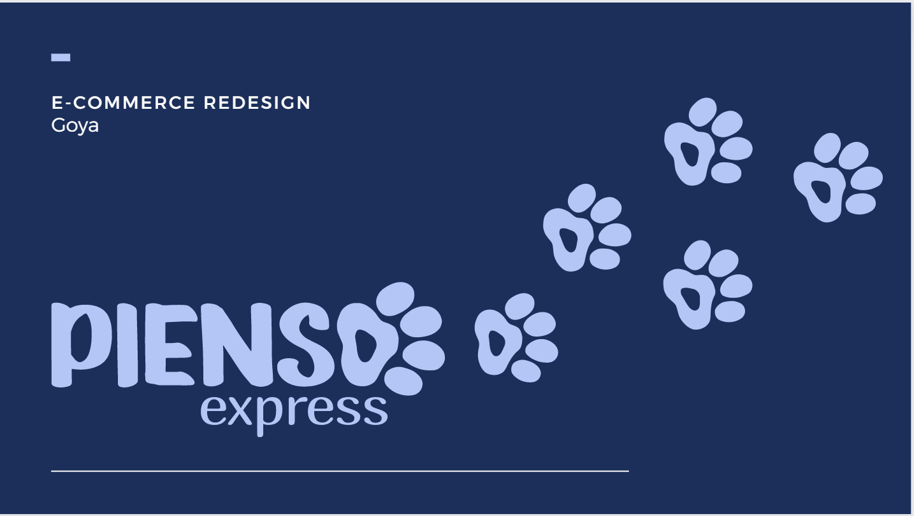
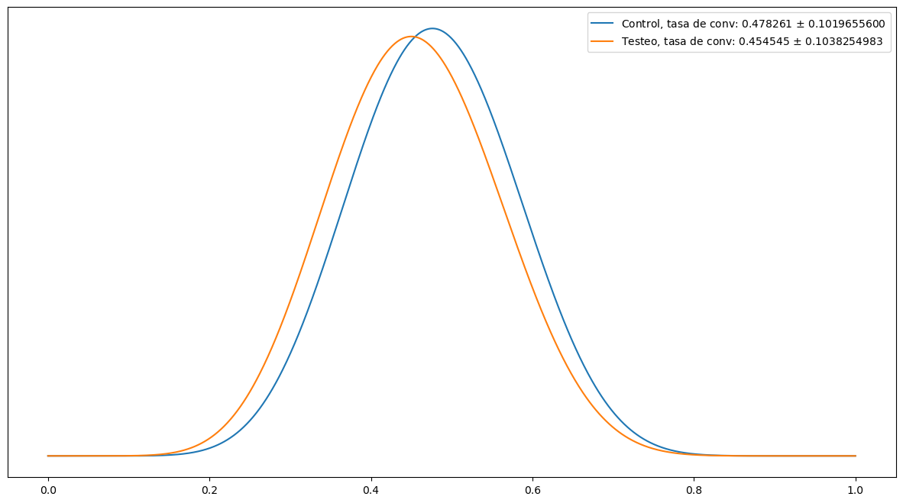
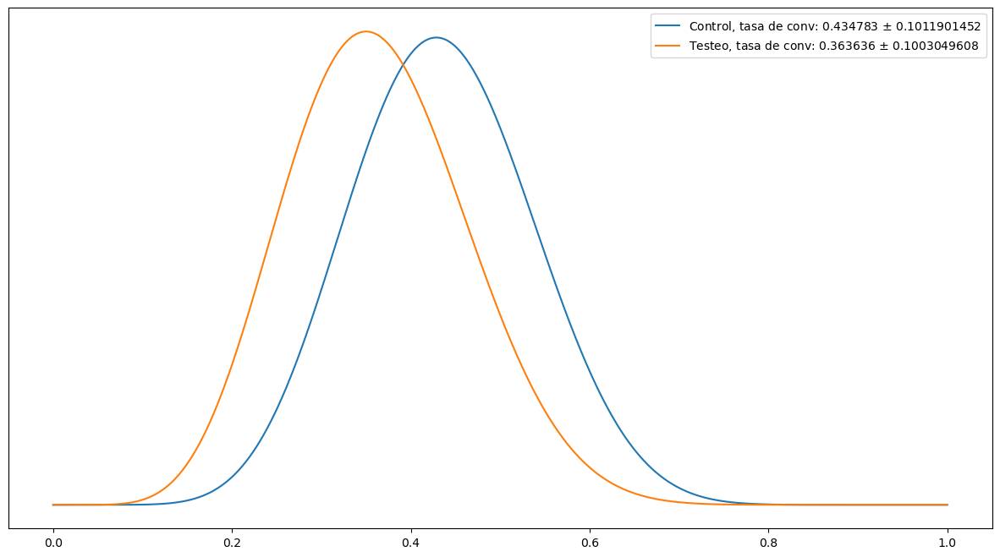

# CRO 

## 1. Descripción del proyecto

El objetivo de este proyecto es realizar una optimización de la tasa de conversión (CRO, por sus siglas en inglés) de una página web, combinando aspectos de venta, marketing y estadística. El enfoque principal es mejorar el rendimiento de la página web en términos de su capacidad para convertir el tráfico entrante en acciones deseadas por parte de los usuarios. El CRO implica realizar cambios y mejoras en la web y utilizar técnicas estadísticas para cuantificar la tasa de conversión.

En este proyecto, se ha creado un prototipo de la página web y se han recopilado datos a través de entrevistas para comprender los pasos que siguen los usuarios al acceder a la web y cómo interactúan con ella hasta lograr un objetivo específico. En este caso, el objetivo es que los usuarios realicen la compra de pienso para perros de la marca Acan. Se han medido dos variables clave: el tiempo que tardan en completar esta tarea y el número de clics necesarios para efectuar la compra.

Utilizando estas dos variables, se ha comparado el prototipo inicial con una nueva versión de la página web que incluye cambios implementados. Se han calculado las tasas de conversión tanto para el número de clics como para el tiempo de compra.

## 2. Pasos del proyecto

1. Definir métricas clave
    - Tiempo
    - Nº clicks

2. Recopilación de datos

3. Preparación de los datos

4. Definir las distribuciones a priori

5. Actualizar las distribuciones beta mediante el uso de técnicas bayesianas

6. Comparar las distribuciones a posteriori

7. Interpretación de los resultados obtenidos

## 3. Resultados

Utilizando el enfoque bayesiano, se han comparado las dos versiones de la página web y se ha observado una disminución tanto en el número de clics necesarios como en el tiempo requerido para completar una compra. Esto ha llevado a la conclusión de que la segunda versión de la página web es más intuitiva y efectiva para los usuarios.

  
Gráfico Tiempo

   

  

  
Gráfico Nº clicks

   

  

Específicamente, se ha encontrado que la nueva versión de la web ha logrado una disminución del tiempo de compra del 4.96% y una reducción del número de clics necesarios del 16.36%.

Estos resultados indican que las mejoras implementadas en la segunda versión de la página web han tenido un impacto positivo en la experiencia del usuario y en la tasa de conversión.